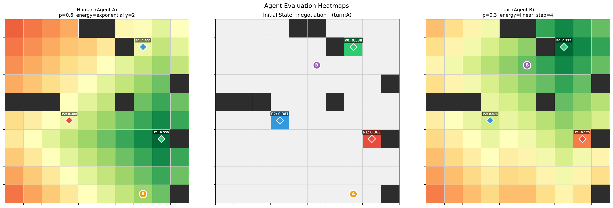
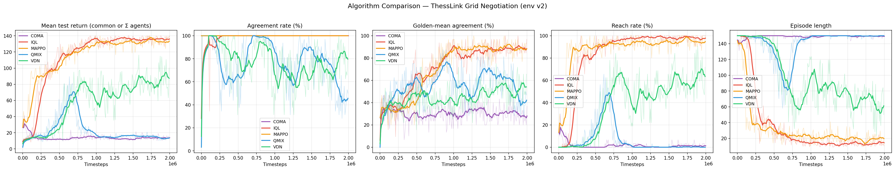
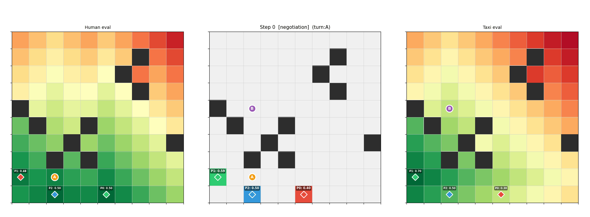
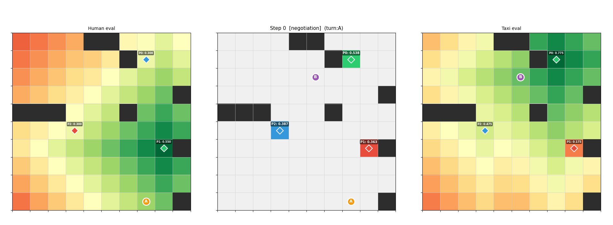

# ThessLink RL - Multi-Agent Grid Negotiation for EPyMARL

Two agents **negotiate** a meeting spot on a 10×10 grid, then **navigate** there. Both phases are learned with RL. Works with [EPyMARL](https://github.com/uoe-agents/epymarl) (QMIX, MAPPO, IQL, VDN, etc.).

## The task

Each episode: two agents spawn on a map with obstacles and **three POIs** (candidate meeting places). From YAML profiles they each prefer some POIs over others—**easier to reach** and/or **better for privacy** from where they started. They take turns suggesting or accepting until they **agree on one POI**, then both **walk to it**. The run ends successfully only when **both** have reached the agreed cell (whoever arrives first waits).

## Environment versions

| Version | Observation | Notes |
|--------|-------------|--------|
| **v0** | Full grid flattened (311 values) | Both agents suggest every step; agreement when they pick the **same** POI on the **same** step. |
| **v1** | Compact vector (19 values) | Turn-based suggest / accept; “GPS” toward target + obstacle sense; no full grid in the observation. |
| **v2** | Same as v1 | Same rules as v1, **plus** extra reward shaping for negotiation and navigation (the default setup in this repo). |

Local scripts use **`config.py` → `ENV_VERSION`** (default **2**). For EPyMARL, pick the matching config name, e.g. **`thesslink_v2`**.

## Environment (v2)

| Aspect | Description |
|--------|-------------|
| Grid | $10 \times 10$, **10** random obstacles, **3** POIs, **2** agents |
| Phases | **Negotiation** (turn-based) then **Navigation** until both stand on the agreed POI |
| Agreement | Active agent suggests a POI or **accepts** the peer’s last suggestion; on accept, navigation begins |
| Agent models | YAML files in `thesslink_rl/models/` (energy model + privacy emphasis) |

## Observation (v2)

Flat vector length **19** (same layout in both phases; values in roughly $[0,1]$ unless noted).

| Block | Size | Content |
|-------|------|---------|
| Phase | 1 | $0$ = negotiation, $1$ = navigation |
| POI scores | 3 | This agent’s preference score for POI $0,1,2$ (from evaluation below) |
| Peer action | 4 | One-hot: no suggestion yet, or peer suggested POI $0,1,2$ |
| Agreed POI | 3 | One-hot of locked-in POI (zeros until agreement) |
| Self position | 2 | Row and column, normalised by grid extent |
| Relative offset | 2 | Toward agreed POI in navigation (zeros in negotiation) |
| Lidar | 4 | Normalised distance to nearest obstacle N, S, E, W |

## Actions (v2)

| ID | Meaning |
|----|---------|
| 0 | Stay |
| 1 | Up |
| 2 | Down |
| 3 | Left |
| 4 | Right |
| 5 | Suggest POI 0 |
| 6 | Suggest POI 1 |
| 7 | Suggest POI 2 |
| 8 | Accept peer’s last suggestion |

In **negotiation**, only the active agent may use actions **5–8**; the other is restricted to a no-op. In **navigation**, both use **0–4**.

## Rewards (v2)

| Phase | What happens | Reward idea |
|-------|----------------|-------------|
| Negotiation | Suggest your best POI, push back on bad offers, or accept a fair one | Small shaping bonuses |
| Negotiation | Agreement reached | $+10 \times \text{quality}$ for everyone (quality from evaluation below) |
| Navigation | Each step | Potential-based move toward target, minus small step cost |
| Navigation | One agent reaches POI | $+10 \times \text{quality}$ for that agent |
| Navigation | **Both** at POI | Extra $+50 \times \text{quality}$ for everyone |

## Evaluation

Each agent loads a profile in [`thesslink_rl/models/`](thesslink_rl/models/): **privacy emphasis** $\alpha \in [0,1]$, **energy** mode (linear or exponential), optional **$\gamma$** (`energy_exponential_gamma`), and **$w$** (`energy_step`, default $1$).

**Distances (BFS on the grid).** For POI $k$: let $d_k$ = steps from the agent’s **current** cell to that POI, and $s_k$ = steps from **spawn** to that POI. Let $D_{\max}$ = largest spawn-to-cell distance among all reachable cells on the map.

**Raw travel cost** to POI $k$ (lower is better to reach):

$$
C_k =
\begin{cases}
w\, d_k & \text{linear} \\[0.4em]
w\,\dfrac{\gamma^{d_k} - 1}{\gamma - 1} & \text{exponential},\ \gamma \neq 1
\end{cases}
$$

(Exponential mode uses a geometric step cost: first step scaled by $w$, then ratio $\gamma$ between successive steps.)

**Privacy** (farther from spawn $\Rightarrow$ higher, map-wide scale):

$$
P_k = \min\!\left(1,\ \frac{s_k}{D_{\max}}\right).
$$

**Energy value** $\tilde{E}_k$: costs $C_0,C_1,C_2$ are min–maxed across the three POIs, then flipped so the cheapest trip gets $1$ and the most expensive gets $0$.

**POI score** (used in observations and rewards):

$$
s_k = (1-\alpha)\,\tilde{E}_k + \alpha\, P_k\,.
$$

**Negotiation quality** after agreement on POI $k^\star$: with $s_k^{(a)}$ = agent $a$’s score,

$$
g_k = \prod_a s_k^{(a)}, \qquad
\text{quality} = \frac{g_{k^\star}}{\max_\ell g_\ell} \in [0,1]\,.
$$

That scalar multiplies the agreement and navigation bonuses in the table above.

**Golden-mean negotiation:** the same product ``g_k`` defines the *best* meeting POI
``argmax_k g_k`` (see ``thesslink_rl.evaluation.optimal_poi``). In logs and plots,
**golden-mean** / **GM** means negotiators agreed on exactly that POI — a strong
mutual deal, stricter than mere **agreement** (any POI). Sacred reports it as
``test_negotiation_optimal_mean``.



## Plots and replays

```bash
python visualize.py
```

Outputs under `plots/<env_tag>/` (e.g. `plots/v2/`):



**MAPPO** — episode replay (agreement **100%**, golden-mean optimal **93.3%**, reach **100%**)



**IQL** — episode replay (agreement **100%**, golden-mean optimal **96.9%**, reach **100%**)



## Algorithms

EPyMARL supports value-decomposition methods (QMIX, VDN, …), actor–critic and policy-gradient variants (MAPPO, IPPO, COMA, …), and independent learners (IQL, IA2C, …). **`common_reward`** comes from **`epymarl_config/envs/<env>.yaml`** for algorithms that support per-agent rewards (IQL, MAPPO); QMIX, VDN, and COMA always use **`common_reward=True`**. You can still override on the command line with Sacred `with common_reward=…`.

## Rendering (optional)

```python
from config import GridNegotiationEnv
from thesslink_rl.visualization import render_grid, capture_frame

env = GridNegotiationEnv(seed=42)
env.reset()
render_grid(env, title="Initial State")
```
